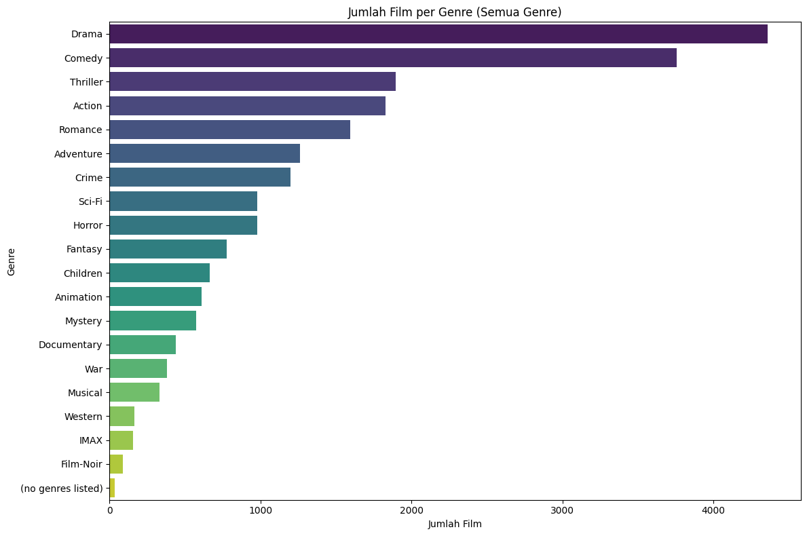
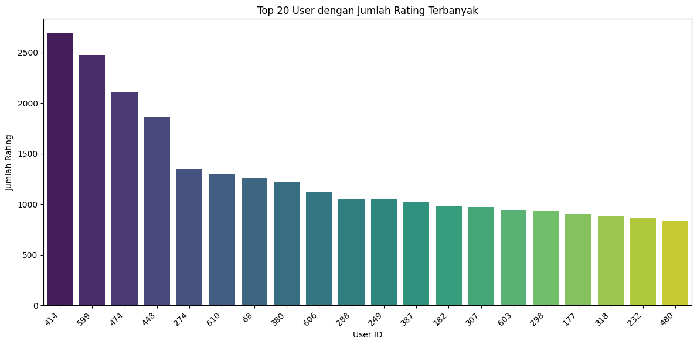
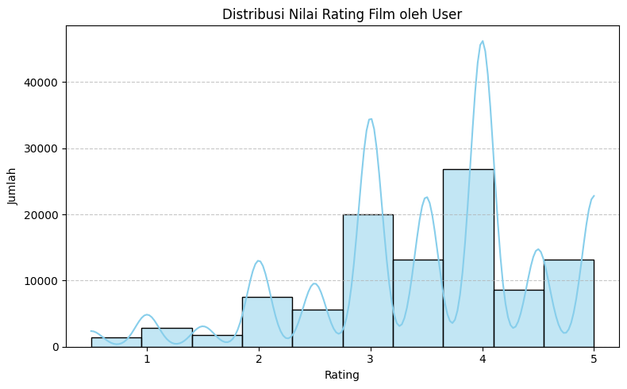
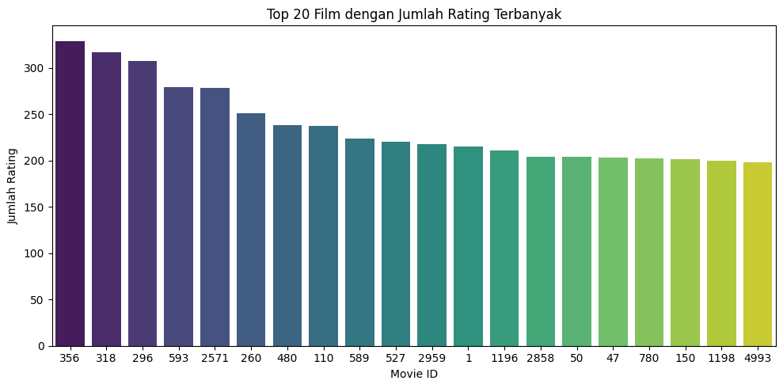
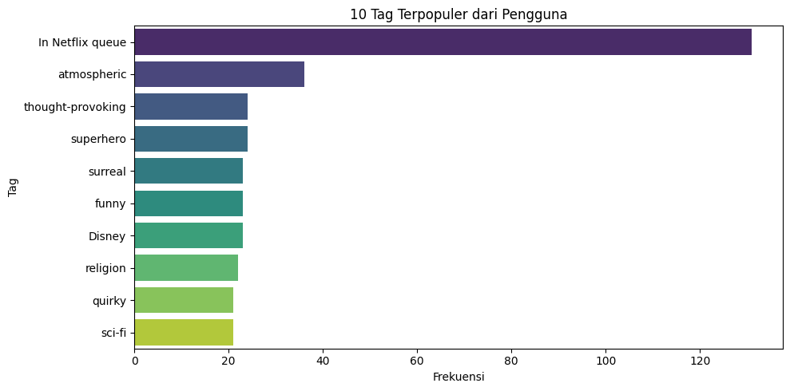

# Laporan Proyek Machine Learning -Tiesya Andriani Ramadhanti
## Project Overview
### Latar Belakang
Dalam era digital saat ini, jumlah konten hiburan seperti film terus meningkat secara signifikan. Pengguna sering kali menghadapi kesulitan dalam memilih film yang sesuai dengan preferensi mereka akibat banyaknya pilihan yang tersedia. Oleh karena itu, dibutuhkan sebuah sistem yang dapat membantu pengguna untuk menemukan film yang relevan dan sesuai dengan minat mereka secara otomatis. Salah satu solusi yang umum digunakan adalah **sistem rekomendasi film** (*movie recommendation system*).Sistem rekomendasi telah menjadi komponen penting dalam berbagai platform digital seperti Netflix, YouTube, dan Amazon. Sistem ini memanfaatkan teknik kecerdasan buatan dan pembelajaran mesin untuk menganalisis data historis pengguna dan menghasilkan rekomendasi yang dipersonalisasi.Pada proyek ini, dibangun sebuah sistem rekomendasi film menggunakan **dataset dari Kaggle** yang berjudul [*Movie Recommendation Data*](https://www.kaggle.com/datasets/rohan4050/movie-recommendation-data). Dataset ini berisi informasi mengenai pengguna, film, dan rating yang diberikan, yang dapat digunakan untuk membangun model rekomendasi berbasis konten (*content-based filtering*) maupun berbasis kolaboratif (*collaborative filtering*).
Tujuan dari proyek ini adalah untuk:
- Menganalisis preferensi pengguna terhadap film berdasarkan data rating.
- Mengembangkan model yang mampu merekomendasikan film secara personal.
- Menyediakan wawasan dari hasil rekomendasi yang dihasilkan sistem.

Dengan adanya sistem ini, diharapkan pengguna dapat memperoleh pengalaman menonton yang lebih baik dan efisien melalui saran film yang sesuai dengan selera mereka.

### Daftar Referensi
Yang, Y., & Woradit, K. (2025). Hybrid Movie Recommendation System with Content-Based and Memory-Based Collaborative Filtering based on Deep Neural Network. *ECTI Transactions on Electrical Engineering, Electronics, and Communications*, 23(1), 131–139. https://doi.org/10.37936/ecti-eec.2525231.255176

## Bussiness Understanding
### Problem Statement
Dengan semakin banyaknya jumlah film yang tersedia setiap tahunnya, pengguna menghadapi tantangan dalam memilih film yang sesuai dengan preferensi mereka. Tanpa sistem rekomendasi yang baik, pengguna bisa merasa kewalahan oleh banyaknya pilihan dan akhirnya menghabiskan waktu lebih lama untuk memilih daripada menonton.
1. Banyak pengguna mengalami kesulitan dalam menemukan film yang sesuai dengan minat atau preferensi pribadi mereka akibat banyaknya pilihan yang tersedia.
2. Film-film berkualitas, khususnya film lama atau kurang populer, seringkali tidak muncul dalam rekomendasi standar dan kurang terekspos oleh pengguna.
3. Belum tersedia sistem rekomendasi yang secara optimal menggabungkan pendekatan *collaborative filtering* dan *content-based filtering* untuk memberikan saran film yang akurat dan personal.

### Goals
Tujuan dari proyek sistem rekomendasi film ini adalah sebagai berikut:
1. Mengembangkan sistem rekomendasi film berbasis data yang mampu memahami preferensi unik dari masing-masing pengguna.
2. Meningkatkan visibilitas film-film berkualitas yang jarang terekspos melalui mekanisme rekomendasi yang lebih cerdas.
3. Menciptakan sistem rekomendasi yang mengintegrasikan metode *collaborative* dan *content-based filtering* untuk menghasilkan saran film yang lebih relevan dan personal.
Dengan tercapainya tujuan ini, sistem diharapkan mampu meningkatkan pengalaman pengguna dalam menemukan film yang relevan dengan cepat dan efisien.

### Solution Approach

Untuk mencapai tujuan di atas, sistem akan dikembangkan dengan mengimplementasikan lebih dari satu pendekatan rekomendasi yang saling melengkapi:

- **Content-Based Filtering**  
Content-Based Filtering menganalisis karakteristik dari film yang disukai oleh pengguna, seperti judul, genre, dan tahun rilis. Sistem kemudian merekomendasikan film lain yang memiliki fitur serupa berdasarkan kemiripan kontennya, sehingga pengguna mendapatkan saran film yang sejalan dengan preferensi pribadi mereka.

- **Collaborative Filtering**  
Collaborative Filtering membangun sistem rekomendasi berdasarkan penilaian atau rating dari pengguna lain. Sistem ini akan menyarankan film yang disukai oleh pengguna dengan preferensi yang mirip, bahkan jika pengguna tersebut belum pernah menonton atau memberikan rating terhadap film tersebut sebelumnya.

## Data Understanding
Dataset yang digunakan dalam proyek ini berjudul [*Movie Recommendation Data*](https://www.kaggle.com/datasets/rohan4050/movie-recommendation-data). dan tersedia di platform Kaggle . Dataset ini berisi data film, rating pengguna, serta informasi terkait yang mendukung pengembangan sistem rekomendasi film.
Terdapat beberapa file utama yang digunakan, yaitu: `movies.csv`, `ratings.csv`, `tags.csv`, dan `links.csv`.

### 1. **movies.csv**

   File ini berisi informasi tentang daftar film yang digunakan sebagai dasar dalam sistem rekomendasi, termasuk judul dan genre dari masing-masing film.
   
   - Jumlah data: 9.742 baris
   - Jumlah kolom: 3 Kolom
   - Missing value: Tidak terdapat missing value pada semua kolom (movieId, title, genres)
    
  | No | Nama Kolom | Tipe Data | Keterangan                                                                                     |
  |----|------------|-----------|------------------------------------------------------------------------------------------------|
  | 0  | movieId    | int64     | ID unik untuk setiap film. Digunakan sebagai penghubung antar file dataset.                    |
  | 1  | title      | object    | Judul lengkap film, biasanya mencantumkan tahun rilis. Contoh: *Toy Story (1995)*.             |
  | 2  | genres     | object    | Genre film tersebut, contoh: `Adventure, Comedy, atau Fantasy`.                                |                            

### 2. **ratings.csv**

File ini berisikan informasi mengenai rating yang diberikan pengguna kepada masing-masing film yang sudah ditontonnya.
- Jumlah Data: 100836 baris
- Jumlah Kolom: 4 Kolom
- Missing Value: Tidak terdapat missing value pada semua kolom (userId, movieId, ratings, timestamp)

| No | Nama Kolom  | Tipe Data | Keterangan                                                                                 |
|----|-------------|-----------|--------------------------------------------------------------------------------------------|
| 0  | `userId`    | int64     | ID unik untuk setiap pengguna yang memberikan rating film.                                 |
| 1  | `movieId`   | int64     | ID unik untuk setiap film yang dinilai, menghubungkan ke dataset film lainnya.             |
| 2  | `rating`    | float64   | Nilai rating yang diberikan pengguna ke film, biasanya dalam rentang 0.5 hingga 5.0.       |
| 3  | `timestamp` | int64     | Waktu ketika rating diberikan, dalam format Unix timestamp (detik sejak 1 Januari 1970).   |

### 3. **tags.csv**,
File ini berisikan informasi mengenai tag atau label tambahan dari pengguna untuk film tertentu.

- Jumlah Data:  3683 Baris
- Jumlah Kolom: 4 Kolom
- Missing Value: Tidak terdapat missing value pada semua kolom (userId, movieId, tag, dan timestamp)

| No | Nama Kolom  | Tipe Data | Keterangan                                                        |
|----|-------------|-----------|------------------------------------------------------------------|
| 0  | `userId`    | int64     | ID unik untuk setiap pengguna yang memberikan tag pada film.     |
| 1  | `movieId`   | int64     | ID unik untuk setiap film yang diberi tag oleh pengguna.         |
| 2  | `tag`       | object    | Kata kunci atau label yang diberikan pengguna untuk mendeskripsikan film. |
| 3  | `timestamp` | int64     | Waktu ketika tag diberikan, dalam format Unix timestamp.         |

### 4. **links.csv**

File ini berisikan penghubung ID film dalam dataset dengan ID film di platform lain seperti IMDb dan TMDb.
- Jumlah Data:  9742
- Jumlah Kolom: 3 Kolom
- Missing Value: Terdapat 8 missing value pada kolom `tmbId`

| No | Nama Kolom | Tipe Data | Keterangan                                                   |
|----|------------|-----------|-------------------------------------------------------------|
| 0  | `movieId`  | int64     | ID unik untuk setiap film, digunakan sebagai kunci utama.   |
| 1  | `imdbId`   | int64     | ID film di database IMDb, digunakan untuk referensi eksternal. |
| 2  | `tmdbId`   | float64   | ID film di database TMDb, digunakan untuk referensi eksternal. Nilai bisa kosong (null). |

## Exploratory Data Analysis (EDA)

Tahap eksplorasi data ini dilakukan untuk memahami karakteristik umum dari dataset film dan interaksi pengguna, termasuk distribusi genre, aktivitas pengguna, serta pola rating film. Visualisasi digunakan untuk mendukung pemahaman data yang akan sangat membantu dalam proses pemodelan sistem rekomendasi film.

### 1.  Jumlah Film Unik

Dataset ini memuat sebanyak **9.742 film unik**, masing-masing diidentifikasi melalui `movieId`. Film pertama dalam dataset adalah *Toy Story (1995)* dengan 215 rating, sedangkan banyak film lainnya hanya menerima satu atau dua rating, seperti *No Game No Life: Zero (2017)* atau *Flint (2017)*.

### 2. Distribusi Genre Film

Berdasarkan grafik jumlah film per genre, dapat disimpulkan bahwa genre Drama dan Comedy merupakan yang paling banyak diproduksi, diikuti oleh Thriller, Action, dan Romance, yang juga menunjukkan popularitas tinggi di industri film. Sementara itu, genre seperti IMAX, Film-Noir, dan (no genres listed) memiliki jumlah film paling sedikit. Data ini mencerminkan keragaman genre dalam industri film serta dapat dijadikan acuan untuk melihat tren pasar, menyusun strategi produksi, atau mengeksplorasi genre-genre yang masih jarang digarap.

### 3. Analisis Aktivitas Pengguna 

Berdasarkan grafik di atas, terlihat bahwa pengguna dengan ID 414 merupakan user yang memberikan rating terbanyak, disusul oleh user ID 599, 474, dan 448. Jumlah rating yang diberikan oleh pengguna menurun secara bertahap dari kiri ke kanan, menunjukkan distribusi kontribusi rating yang tidak merata di mana hanya sebagian kecil pengguna yang sangat aktif dalam memberikan penilaian. Hal ini dapat dimanfaatkan untuk memahami perilaku pengguna aktif serta menentukan target dalam strategi personalisasi atau promosi yang lebih tepat sasaran.

### 4. Analisis Distribusi Rating Berdasarkan Aktivitas Pengguna dan Popularitas Film

Berdasarkan grafik di atas, terlihat bahwa pengguna dengan ID 414 merupakan user yang memberikan rating terbanyak, disusul oleh user ID 599, 474, dan 448. Jumlah rating yang diberikan oleh pengguna menurun secara bertahap dari kiri ke kanan, menunjukkan distribusi kontribusi rating yang tidak merata, di mana hanya sebagian kecil pengguna yang sangat aktif dalam memberikan penilaian. Hal ini dapat dimanfaatkan untuk memahami perilaku pengguna aktif serta menentukan target dalam strategi personalisasi atau promosi yang lebih tepat sasaran.

Selain dari sisi pengguna, jika ditinjau dari sisi film, terlihat bahwa film dengan Movie ID 356, 318, dan 296 adalah yang menerima jumlah rating terbanyak. Ini menunjukkan bahwa beberapa film memiliki tingkat popularitas yang sangat tinggi dan mampu menarik perhatian banyak pengguna untuk memberikan rating. Distribusi ini mengindikasikan adanya konsentrasi minat pada film-film tertentu yang kemungkinan besar memiliki kualitas cerita yang baik, aktor terkenal, atau eksposur yang tinggi di media.

### 8. Tag Populer

Grafik di atas menunjukkan 10 tag terpopuler yang digunakan oleh pengguna, di mana tag "In Netflix queue" menempati posisi teratas dengan frekuensi jauh lebih tinggi dibandingkan tag lainnya, menunjukkan bahwa banyak pengguna menggunakan tag ini sebagai pengingat tontonan. Tag "atmospheric" berada di urutan kedua, mengindikasikan ketertarikan terhadap film dengan suasana yang kuat. Sementara itu, tag seperti "thought-provoking", "superhero", dan "sci-fi" memiliki frekuensi yang relatif rendah, meskipun secara umum genre tersebut cukup populer. Tag lainnya seperti "quirky", "surreal", dan "funny" mencerminkan variasi selera pengguna terhadap gaya dan tone film. Keberadaan tag "Disney" dan "religion" juga memperlihatkan bahwa topik berdasarkan entitas dan tema khusus tetap mendapat perhatian meskipun tidak dominan. Secara keseluruhan, grafik ini memperlihatkan bahwa fungsi praktis (seperti menyimpan tontonan) lebih sering digunakan daripada tag berbasis genre atau tema.

