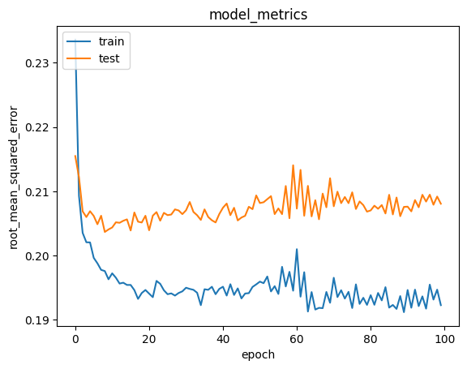
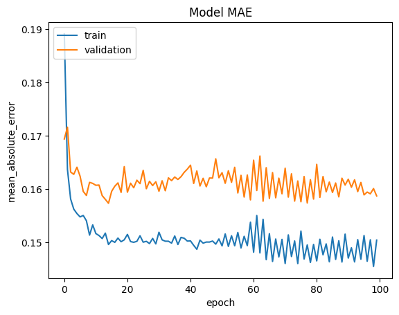

# Laporan Proyek Machine Learning -Tiesya Andriani Ramadhanti
## Project Overview
### Latar Belakang

Dalam era digital saat ini, jumlah konten hiburan seperti film terus meningkat secara signifikan. Pengguna sering kali menghadapi kesulitan dalam memilih film yang sesuai dengan preferensi mereka akibat banyaknya pilihan yang tersedia. Oleh karena itu, dibutuhkan sebuah sistem yang dapat membantu pengguna untuk menemukan film yang relevan dan sesuai dengan minat mereka secara otomatis. Salah satu solusi yang umum digunakan adalah **sistem rekomendasi film** (*movie recommendation system*).
Sistem rekomendasi telah menjadi komponen penting dalam berbagai platform digital seperti Netflix, YouTube, dan Amazon. Sistem ini memanfaatkan teknik kecerdasan buatan dan pembelajaran mesin untuk menganalisis data historis pengguna dan menghasilkan rekomendasi yang dipersonalisasi. Menurut **Yang dan Woradit (2025)**, sistem rekomendasi hibrida yang menggabungkan pendekatan berbasis konten dan kolaboratif mampu meningkatkan akurasi rekomendasi hingga 10%, yang menjadikannya semakin krusial dalam meningkatkan pengalaman pengguna di platform-platform besar.
Pada proyek ini, dibangun sebuah sistem rekomendasi film menggunakan **dataset dari Kaggle** yang berjudul [*Movie Recommendation Data*](https://www.kaggle.com/datasets/rohan4050/movie-recommendation-data). Dataset ini berisi informasi mengenai pengguna, film, dan rating yang diberikan, yang dapat digunakan untuk membangun model rekomendasi berbasis konten (*content-based filtering*) maupun berbasis kolaboratif (*collaborative filtering*).

Tujuan dari proyek ini adalah untuk:
- Menganalisis preferensi pengguna terhadap film berdasarkan data rating.
- Mengembangkan model yang mampu merekomendasikan film secara personal.
- Menyediakan wawasan dari hasil rekomendasi yang dihasilkan sistem.

Dengan adanya sistem ini, diharapkan pengguna dapat memperoleh pengalaman menonton yang lebih baik dan efisien melalui saran film yang sesuai dengan selera mereka.

### Daftar Referensi
Yang, Y., & Woradit, K. (2025). Hybrid Movie Recommendation System with Content-Based and Memory-Based Collaborative Filtering based on Deep Neural Network. *ECTI Transactions on Electrical Engineering, Electronics, and Communications*, 23(1), 131–139. https://doi.org/10.37936/ecti-eec.2525231.255176

## Bussiness Understanding
### Problem Statement
Dengan semakin banyaknya jumlah film yang tersedia setiap tahunnya, pengguna menghadapi tantangan dalam memilih film yang sesuai dengan preferensi mereka. Tanpa sistem rekomendasi yang baik, pengguna bisa merasa kewalahan oleh banyaknya pilihan dan akhirnya menghabiskan waktu lebih lama untuk memilih daripada menonton.
1. Banyak pengguna mengalami kesulitan dalam menemukan film yang sesuai dengan minat atau preferensi pribadi mereka akibat banyaknya pilihan yang tersedia.
2. Film-film berkualitas, khususnya film lama atau kurang populer, seringkali tidak muncul dalam rekomendasi standar dan kurang terekspos oleh pengguna.
3. Belum tersedia sistem rekomendasi yang secara optimal menggabungkan pendekatan *collaborative filtering* dan *content-based filtering* untuk memberikan saran film yang akurat dan personal.

### Goals
Tujuan dari proyek sistem rekomendasi film ini adalah sebagai berikut:
1. Mengembangkan sistem rekomendasi film berbasis data yang mampu memahami preferensi unik dari masing-masing pengguna.
2. Meningkatkan visibilitas film-film berkualitas yang jarang terekspos melalui mekanisme rekomendasi yang lebih cerdas.
3. Menciptakan sistem rekomendasi yang mengintegrasikan metode *collaborative* dan *content-based filtering* untuk menghasilkan saran film yang lebih relevan dan personal.
Dengan tercapainya tujuan ini, sistem diharapkan mampu meningkatkan pengalaman pengguna dalam menemukan film yang relevan dengan cepat dan efisien.

### Solution Approach

Untuk mencapai tujuan di atas, sistem akan dikembangkan dengan mengimplementasikan lebih dari satu pendekatan rekomendasi yang saling melengkapi:

- **Content-Based Filtering**  
Content-Based Filtering menganalisis karakteristik dari film yang disukai oleh pengguna, seperti judul, genre, dan tahun rilis. Sistem kemudian merekomendasikan film lain yang memiliki fitur serupa berdasarkan kemiripan kontennya, sehingga pengguna mendapatkan saran film yang sejalan dengan preferensi pribadi mereka.

- **Collaborative Filtering**  
Collaborative Filtering membangun sistem rekomendasi berdasarkan penilaian atau rating dari pengguna lain. Sistem ini akan menyarankan film yang disukai oleh pengguna dengan preferensi yang mirip, bahkan jika pengguna tersebut belum pernah menonton atau memberikan rating terhadap film tersebut sebelumnya.

## Data Understanding
Dataset yang digunakan dalam proyek ini berjudul [*Movie Recommendation Data*](https://www.kaggle.com/datasets/rohan4050/movie-recommendation-data). dan tersedia di platform Kaggle . Dataset ini berisi data film, rating pengguna, serta informasi terkait yang mendukung pengembangan sistem rekomendasi film.
Terdapat beberapa file utama yang digunakan, yaitu: `movies.csv`, `ratings.csv`, `tags.csv`, dan `links.csv`.

### 1. **movies.csv**

   File ini berisi informasi tentang daftar film yang digunakan sebagai dasar dalam sistem rekomendasi, termasuk judul dan genre dari masing-masing film.
   
   - Jumlah data: 9.742 baris
   - Jumlah kolom: 3 Kolom
   - Missing value: Tidak terdapat missing value pada semua kolom (movieId, title, genres)
    
  | No | Nama Kolom | Tipe Data | Keterangan                                                                                     |
  |----|------------|-----------|------------------------------------------------------------------------------------------------|
  | 0  | movieId    | int64     | ID unik untuk setiap film. Digunakan sebagai penghubung antar file dataset.                    |
  | 1  | title      | object    | Judul lengkap film, biasanya mencantumkan tahun rilis. Contoh: *Toy Story (1995)*.             |
  | 2  | genres     | object    | Genre film tersebut, contoh: `Adventure, Comedy, atau Fantasy`.                                |                            

### 2. **ratings.csv**

File ini berisikan informasi mengenai rating yang diberikan pengguna kepada masing-masing film yang sudah ditontonnya.
- Jumlah Data: 100836 baris
- Jumlah Kolom: 4 Kolom
- Missing Value: Tidak terdapat missing value pada semua kolom (userId, movieId, ratings, timestamp)

| No | Nama Kolom  | Tipe Data | Keterangan                                                                                 |
|----|-------------|-----------|--------------------------------------------------------------------------------------------|
| 0  | `userId`    | int64     | ID unik untuk setiap pengguna yang memberikan rating film.                                 |
| 1  | `movieId`   | int64     | ID unik untuk setiap film yang dinilai, menghubungkan ke dataset film lainnya.             |
| 2  | `rating`    | float64   | Nilai rating yang diberikan pengguna ke film, biasanya dalam rentang 0.5 hingga 5.0.       |
| 3  | `timestamp` | int64     | Waktu ketika rating diberikan, dalam format Unix timestamp (detik sejak 1 Januari 1970).   |

### 3. **tags.csv**,
File ini berisikan informasi mengenai tag atau label tambahan dari pengguna untuk film tertentu.

- Jumlah Data:  3683 Baris
- Jumlah Kolom: 4 Kolom
- Missing Value: Tidak terdapat missing value pada semua kolom (userId, movieId, tag, dan timestamp)

| No | Nama Kolom  | Tipe Data | Keterangan                                                        |
|----|-------------|-----------|------------------------------------------------------------------|
| 0  | `userId`    | int64     | ID unik untuk setiap pengguna yang memberikan tag pada film.     |
| 1  | `movieId`   | int64     | ID unik untuk setiap film yang diberi tag oleh pengguna.         |
| 2  | `tag`       | object    | Kata kunci atau label yang diberikan pengguna untuk mendeskripsikan film. |
| 3  | `timestamp` | int64     | Waktu ketika tag diberikan, dalam format Unix timestamp.         |

### 4. **links.csv**

File ini berisikan penghubung ID film dalam dataset dengan ID film di platform lain seperti IMDb dan TMDb.
- Jumlah Data:  9742
- Jumlah Kolom: 3 Kolom
- Missing Value: Terdapat 8 missing value pada kolom `tmbId`

| No | Nama Kolom | Tipe Data | Keterangan                                                   |
|----|------------|-----------|-------------------------------------------------------------|
| 0  | `movieId`  | int64     | ID unik untuk setiap film, digunakan sebagai kunci utama.   |
| 1  | `imdbId`   | int64     | ID film di database IMDb, digunakan untuk referensi eksternal. |
| 2  | `tmdbId`   | float64   | ID film di database TMDb, digunakan untuk referensi eksternal. Nilai bisa kosong (null). |

## Exploratory Data Analysis (EDA)

Tahap eksplorasi data ini dilakukan untuk memahami karakteristik umum dari dataset film dan interaksi pengguna, termasuk distribusi genre, aktivitas pengguna, serta pola rating film. Visualisasi digunakan untuk mendukung pemahaman data yang akan sangat membantu dalam proses pemodelan sistem rekomendasi film.

### 1.  Jumlah Film Unik

Dataset ini memuat sebanyak **9.742 film unik**, masing-masing diidentifikasi melalui `movieId`. Film pertama dalam dataset adalah *Toy Story (1995)* dengan 215 rating, sedangkan banyak film lainnya hanya menerima satu atau dua rating, seperti *No Game No Life: Zero (2017)* atau *Flint (2017)*.

### 2. Distribusi Genre Film


Berdasarkan grafik jumlah film per genre, dapat disimpulkan bahwa genre Drama dan Comedy merupakan yang paling banyak diproduksi, diikuti oleh Thriller, Action, dan Romance, yang juga menunjukkan popularitas tinggi di industri film. Sementara itu, genre seperti IMAX, Film-Noir, dan (no genres listed) memiliki jumlah film paling sedikit. Data ini mencerminkan keragaman genre dalam industri film serta dapat dijadikan acuan untuk melihat tren pasar, menyusun strategi produksi, atau mengeksplorasi genre-genre yang masih jarang digarap.

### 3. Analisis Aktivitas Pengguna 


Berdasarkan grafik di atas, terlihat bahwa pengguna dengan ID 414 merupakan user yang memberikan rating terbanyak, disusul oleh user ID 599, 474, dan 448. Jumlah rating yang diberikan oleh pengguna menurun secara bertahap dari kiri ke kanan, menunjukkan distribusi kontribusi rating yang tidak merata di mana hanya sebagian kecil pengguna yang sangat aktif dalam memberikan penilaian. Hal ini dapat dimanfaatkan untuk memahami perilaku pengguna aktif serta menentukan target dalam strategi personalisasi atau promosi yang lebih tepat sasaran.

### 4. Analisis Distribusi Rating Berdasarkan Aktivitas Pengguna dan Popularitas Film


Berdasarkan grafik di atas, terlihat bahwa pengguna dengan ID 414 merupakan user yang memberikan rating terbanyak, disusul oleh user ID 599, 474, dan 448. Jumlah rating yang diberikan oleh pengguna menurun secara bertahap dari kiri ke kanan, menunjukkan distribusi kontribusi rating yang tidak merata, di mana hanya sebagian kecil pengguna yang sangat aktif dalam memberikan penilaian. Hal ini dapat dimanfaatkan untuk memahami perilaku pengguna aktif serta menentukan target dalam strategi personalisasi atau promosi yang lebih tepat sasaran.

Selain dari sisi pengguna, jika ditinjau dari sisi film, terlihat bahwa film dengan Movie ID 356, 318, dan 296 adalah yang menerima jumlah rating terbanyak. Ini menunjukkan bahwa beberapa film memiliki tingkat popularitas yang sangat tinggi dan mampu menarik perhatian banyak pengguna untuk memberikan rating. Distribusi ini mengindikasikan adanya konsentrasi minat pada film-film tertentu yang kemungkinan besar memiliki kualitas cerita yang baik, aktor terkenal, atau eksposur yang tinggi di media.

### 5. Tag Populer


Grafik di atas menunjukkan 10 tag terpopuler yang digunakan oleh pengguna, di mana tag "In Netflix queue" menempati posisi teratas dengan frekuensi jauh lebih tinggi dibandingkan tag lainnya, menunjukkan bahwa banyak pengguna menggunakan tag ini sebagai pengingat tontonan. Tag "atmospheric" berada di urutan kedua, mengindikasikan ketertarikan terhadap film dengan suasana yang kuat. Sementara itu, tag seperti "thought-provoking", "superhero", dan "sci-fi" memiliki frekuensi yang relatif rendah, meskipun secara umum genre tersebut cukup populer. Tag lainnya seperti "quirky", "surreal", dan "funny" mencerminkan variasi selera pengguna terhadap gaya dan tone film. Keberadaan tag "Disney" dan "religion" juga memperlihatkan bahwa topik berdasarkan entitas dan tema khusus tetap mendapat perhatian meskipun tidak dominan. Secara keseluruhan, grafik ini memperlihatkan bahwa fungsi praktis (seperti menyimpan tontonan) lebih sering digunakan daripada tag berbasis genre atau tema.

## Data Preprocessing
### 1. Menggabungkan Variabel movieId Seluruh Dataset

Pada tahapan ini, dilakukan proses penggabungan seluruh `movieId` yang terdapat pada empat dataset utama, yaitu `movies`, `ratings`, `tags`, dan `links`. Tujuannya adalah untuk memperoleh daftar lengkap semua ID film yang muncul di berbagai bagian data.
Setelah seluruh `movieId` digabungkan, dilakukan penghapusan duplikasi agar hanya tersisa ID yang unik. Selanjutnya, ID-ID tersebut diurutkan untuk memudahkan proses referensi dan pencocokan antar tabel di tahapan selanjutnya. 
   
### 2. Menggabungkan Seluruh User

Pada tahapan ini, dilakukan penggabungan seluruh user yang bertujuan untuk mengidentifikasi seluruh pengguna (`userId`) yang terdapat dalam dataset. Data `userId` diambil dari dua sumber utama, yaitu tabel `ratings` dan `tags`, karena kedua tabel ini merekam aktivitas pengguna terhadap film—baik dalam bentuk pemberian rating maupun penambahan tag.
Seluruh ID pengguna kemudian digabungkan menjadi satu array, dan dilakukan penghapusan data duplikat untuk mendapatkan daftar pengguna yang unik. Setelah itu, `userId` diurutkan guna memudahkan pengolahan lebih lanjut.

### 3. Menggabungkan Seluruh Dataset

Pada tahapan ini, dilakukan penggabungan beberapa dataset utama yaitu `ratings_df`, `movies_df`, `links_df`, dan `tags_df`. Penggabungan dilakukan secara bertahap menggunakan fungsi `merge()` berdasarkan kolom `movieId` dan `userId`, dengan metode join `left` agar seluruh data dari `ratings_df` tetap terjaga.
Setelah proses penggabungan, dilakukan penghapusan baris duplikat menggunakan fungsi `drop_duplicates()` dengan acuan kombinasi `userId` dan `movieId`, agar setiap pengguna hanya memberikan satu penilaian untuk satu film.
Terakhir, dataset `movie_merge` diurutkan berdasarkan `userId` dan `movieId` agar tampilan data menjadi lebih rapi dan terstruktur. 

### 4. Memeriksa Missing Value

Pada tahapan ini, dilakukan pengecekan terhadap nilai yang hilang (*missing values*) dalam dataframe `movie_merge` yang merupakan hasil penggabungan beberapa dataset sebelumnya. Langkah ini penting untuk memastikan bahwa tidak ada kolom yang mengandung data kosong yang dapat mengganggu proses analisis atau pemodelan sistem rekomendasi.
Digunakan juga fungsi `.isnull().sum()` untuk menghitung jumlah nilai kosong pada setiap kolom. Hasil dari proses ini akan menjadi acuan untuk menentukan apakah perlu dilakukan penanganan data hilang, seperti penghapusan baris atau pengisian nilai tertentu.

### 5. Penggabungan Ratings Berdasarkan Variabel movieId

Pada tahapan ini, data yang sudah digabungkan dalam `movie_merge` dikelompokkan berdasarkan kolom `movieId` menggunakan fungsi `groupby()`. Kemudian dilakukan agregasi dengan fungsi `sum()` untuk menjumlahkan nilai numerik yang ada pada setiap kelompok film.
Proses ini berguna untuk mendapatkan ringkasan statistik total dari berbagai atribut yang berkaitan dengan masing-masing film, misalnya total rating atau jumlah tag jika dalam bentuk angka, sehingga memudahkan analisis lebih lanjut pada tingkat film.

### 6. Menyimpan Data Rating Film

Pada tahapan ini, seluruh data rating yang terdapat pada `ratings_df` disimpan ke dalam variabel `all_movie_rate`. Variabel ini akan digunakan untuk analisis atau proses lanjutan yang berfokus pada data rating film tanpa mengubah isi aslinya.
Proses ini memudahkan pemisahan data rating dari dataset lainnya agar lebih mudah dikelola dan dianalisis secara spesifik.

### 7. Menggabungkan Data Rating dengan Informasi Film

Pada tahapan ini, data rating yang sudah disimpan pada variabel `all_movie_rate` digabungkan (merge) dengan data film (`movies_df`) yang berisi informasi `title` dan `genres` berdasarkan kolom `movieId`.

Tujuannya adalah untuk mengaitkan setiap rating dengan judul film dan genre-nya, sehingga analisis selanjutnya dapat dilakukan dengan konteks film yang lengkap, bukan hanya berdasarkan ID film saja. Metode penggabungan yang digunakan adalah `left join` agar seluruh data rating tetap dipertahankan walaupun ada beberapa film yang mungkin tidak memiliki informasi lengkap pada tabel film.

### 8. Penggabungan Data Genre dan Tag pada Film

Pada tahapan ini, dataframe `all_movie_name` yang sudah berisi data rating beserta judul dan genre film digabungkan lagi dengan data `tags_df` yang berisi tag atau label yang diberikan oleh pengguna untuk setiap film berdasarkan `movieId`.
Penggabungan menggunakan metode `left join` pada kolom `movieId` bertujuan untuk menambahkan informasi tag pada masing-masing film. Dengan ini, variabel `all_movie` akan berisi informasi lengkap mulai dari rating, judul, genre, hingga tag yang terkait dengan film tersebut. Data ini nantinya sangat berguna untuk analisis lebih mendalam terkait preferensi pengguna dan karakteristik film.

## Data Preparation

### 1. Penanganan Missing Value

Pada tahapan ini, dilakukan pemeriksaan terhadap keberadaan nilai kosong (missing values) pada dataset `all_movie` menggunakan fungsi `isnull().sum()`. Hasil pemeriksaan menunjukkan ada beberapa nilai yang kosong, terutama pada kolom yang berasal dari penggabungan tag film.
Untuk memastikan kualitas data yang baik dalam analisis selanjutnya, dilakukan pembersihan dengan menghapus seluruh baris yang mengandung missing value menggunakan fungsi `dropna()`. Dataset hasil pembersihan ini disimpan dalam variabel `clean_all_movie`.
Setelah proses pembersihan, dilakukan pengecekan ulang untuk memastikan bahwa tidak ada lagi nilai kosong yang tersisa dalam dataset `clean_all_movie`.

### 2. Tahapan Pengurutan dan Pemeriksaan Film Unik

Pada tahapan ini, dataset `clean_all_movie` diurutkan berdasarkan kolom `movieId` secara ascending (dari nilai terkecil ke terbesar) menggunakan fungsi `sort_values()`. Hasil pengurutan ini disimpan ke dalam variabel `final_movie` agar data menjadi lebih terstruktur dan mudah untuk dianalisis lebih lanjut.
Selanjutnya, dilakukan pengecekan jumlah film unik pada dataset `final_movie` dengan menghitung banyaknya nilai unik pada kolom `movieId` menggunakan fungsi `unique()` dan `len()`. Ini bertujuan untuk memastikan jumlah total film yang ada setelah proses pembersihan dan pengurutan data.

### 3. Tahapan Finalisasi Data Film

Pada tahapan ini, data `final_movie` kembali diurutkan berdasarkan kolom `movieId` menggunakan fungsi `sort_values()` untuk memastikan data tersusun rapi. Setelah itu, indeks pada dataframe direset dengan `reset_index(drop=True)` agar indeks baru dimulai dari 0 dan indeks lama dihapus.
Hasilnya disimpan dalam variabel `prepared_movies` yang siap digunakan untuk analisis atau pemodelan selanjutnya, dengan data yang sudah bersih, terurut, dan terindeks dengan benar.

### 4. Pengecekan dan Penghapusan Duplikat Film

Pada tahapan ini, dilakukan pengecekan jumlah data yang duplikat berdasarkan kolom `movieId` menggunakan fungsi `duplicated()`. Variabel `jumlah_duplikat` menyimpan total baris yang duplikat.
Selanjutnya, data yang memiliki `movieId` duplikat dihapus dengan fungsi `drop_duplicates()`, sehingga hanya tersisa satu baris unik untuk setiap film.
Data hasil pembersihan duplikat ini kemudian disimpan kembali ke variabel `prepared_movies` dan siap untuk analisis lebih lanjut tanpa risiko data ganda.

### 5. Konversi Data Series Menjadi List

Pada tahap ini, tiga kolom utama dari dataframe `prepared_movies` diubah menjadi format list untuk memudahkan pemrosesan lebih lanjut, terutama dalam konteks pembuatan sistem rekomendasi atau analisis yang memerlukan input dalam bentuk list.

- Variabel `movie_id` berisi daftar unik `movieId`.
- Variabel `movie_name` berisi daftar judul film (`title`).
- Variabel `movie_genre` berisi daftar genre film (`genres`).

Jumlah elemen pada ketiga list tersebut diperiksa menggunakan fungsi `len()` untuk memastikan bahwa semua list memiliki panjang yang sama, yang menandakan konsistensi data.

### 6. Membuat DataFrame Baru

Pada tahapan ini, dilakukan pembuatan dataframe baru bernama `new_movies` yang merupakan hasil dari penggabungan tiga list: `movie_id`, `movie_name`, dan `movie_genre`. Ketiga list ini sebelumnya telah dikonversi dari dataframe `prepared_movies`.

Fungsi `pd.DataFrame()` digunakan untuk membentuk struktur data tabular yang terdiri dari tiga kolom:
- `id` untuk menyimpan nilai `movie_id`,
- `movie_name` untuk menyimpan judul film,
- `genre` untuk menyimpan informasi genre dari masing-masing film.
- 
Proses ini bertujuan untuk mempersiapkan data yang lebih terstruktur dan siap digunakan untuk analisis lebih lanjut.

### 7. Persiapan Content-Based Filtering

#### Tahapan Proses:

**a. Inisialisasi dan Pelatihan TF-IDF Vectorizer:**

Melakukan inisialisasi dan pelatihan TF-IDF pada data genre untuk membentuk matriks fitur.

```python
tf = TfidfVectorizer()
tf.fit(new_movies['genre'])
tf.get_feature_names_out()
```

**b. Transformasi Genre menjadi Matriks TF-IDF**

Pada tahap ini, genre dari setiap film diubah menjadi representasi vektor numerik menggunakan metode TF-IDF. TF-IDF (Term Frequency-Inverse Document Frequency) membantu mengukur seberapa penting suatu kata (dalam hal ini genre) dalam satu dokumen relatif terhadap seluruh kumpulan dokumen.

```python
tfidf_matrix = tf.fit_transform(new_movies['genre'])
tfidf_matrix.shape 
```
**c. Pembentukan Matriks Kemiripan (Cosine Similarity)**

Setelah genre diformat ke dalam bentuk vektor melalui TF-IDF, langkah selanjutnya adalah menghitung tingkat kemiripan antar film menggunakan cosine similarity. Cosine similarity mengukur sudut antara dua vektor dalam ruang multidimensi, di mana nilai yang mendekati 1 menunjukkan kemiripan tinggi, sedangkan nilai mendekati 0 menunjukkan kemiripan rendah.

```python
cosine_sim = cosine_similarity(tfidf_matrix)
cosine_sim
```
Selanjutnya membuat DataFrame dari matriks kemiripan tersebut dengan indeks dan kolom berupa nama film agar lebih mudah diinterpretasi.

```python
cosine_sim_df = pd.DataFrame(cosine_sim, index=new_movies['movie_name'], columns=new_movies['movie_name'])
```

**d. Fungsi Rekomendasi Film Berdasarkan Kemiripan Konten**

Fungsi `movie_recommendations` bertujuan untuk memberikan daftar rekomendasi film yang paling mirip dengan film input (`nama_film`) berdasarkan matriks kemiripan (`similarity_data`).

- Parameter fungsi:
  - `nama_film`: Judul film yang dijadikan acuan untuk mencari rekomendasi.
  - `similarity_data`: DataFrame matriks kemiripan antar film (default menggunakan `cosine_sim_df`).
  - `items`: DataFrame yang berisi informasi film seperti judul dan genre (default menggunakan subset dari `new_movies`).
  - `k`: Jumlah rekomendasi yang ingin ditampilkan (default 10).

- Cara kerja fungsi:
  1. Mendapatkan indeks film yang memiliki nilai kemiripan tertinggi dengan film input menggunakan metode `argpartition` untuk efisiensi.
  2. Mengambil judul film yang paling mirip tersebut.
  3. Menghapus film input dari daftar rekomendasi agar tidak muncul sebagai rekomendasi dirinya sendiri.
  4. Menggabungkan daftar film terdekat dengan informasi film dari `items`.
  5. Mengembalikan hasil berupa DataFrame berisi rekomendasi film dengan jumlah maksimal `k`.

- Fungsi ini memungkinkan pengguna mendapatkan rekomendasi film serupa secara cepat berdasarkan genre yang sudah diolah dengan TF-IDF dan cosine similarity.

```python
def movie_recommendations(nama_film, similarity_data=cosine_sim_df, items=new_movies[['movie_name', 'genre']], k=10):
    index = similarity_data.loc[:, nama_film].to_numpy().argpartition(range(-1, -k, -1))
    closest = similarity_data.columns[index[-1:-(k+2):-1]]
    closest = closest.drop(nama_film, errors='ignore')
    return pd.DataFrame(closest).merge(items).head(k)
```
### 8. Persiapan Collaborative Filtering

#### Tahapan Proses:

**a. Menyalin Dataset Asli**

Langkah pertama adalah membuat salinan dataset `ratings_df` ke dalam variabel `df` agar proses selanjutnya tidak mengubah data asli.

```python
df = ratings_df
df
```
**b. Encoding userId**

Langkah selanjutnya adalah melakukan encoding terhadap `userId`. Pertama, diambil seluruh nilai unik dari kolom `userId` untuk mendapatkan daftar pengguna tanpa duplikasi. Kemudian, dilakukan proses encoding yaitu mengubah setiap `userId` menjadi angka menggunakan `enumerate` yang disimpan ke dalam dictionary `user_to_user_encoded`.
Selain itu, dibuat juga dictionary kebalikannya, yaitu `user_encoded_to_user`, yang berguna untuk mengonversi kembali dari nilai numerik ke `userId` aslinya.

```python
user_ids = df['userId'].unique().tolist()
user_to_user_encoded = {x: i for i, x in enumerate(user_ids)}
user_encoded_to_user = {i: x for i, x in enumerate(user_ids)}
```

**c. Encoding movieId**

Selanjutnya dilakukan proses encoding pada kolom `movieId`. Pertama, semua nilai unik dari `movieId` diambil untuk membentuk daftar film tanpa duplikasi. Setelah itu, setiap `movieId` diubah menjadi representasi angka menggunakan `enumerate`, dan hasilnya disimpan ke dalam dictionary `movie_to_movie_encoded`. Untuk keperluan decoding kembali, dibuat juga dictionary kebalikannya yaitu `movie_encoded_to_movie`.

```python
movie_ids = df['movieId'].unique().tolist()
movie_to_movie_encoded = {x: i for i, x in enumerate(movie_ids)}
movie_encoded_to_movie = {i: x for i, x in enumerate(movie_ids)}
```
Setelah proses encoding, hasilnya kemudian dipetakan ke dalam dataframe. Kolom `genres` diisi dengan hasil mapping dari `userId` yang telah diencoding, sedangkan kolom movies diisi dengan hasil encoding dari `movieId`.

```python
df['genres'] = df['userId'].map(user_to_user_encoded)
df['movies'] = df['movieId'].map(movie_to_movie_encoded)
```

**d. Menentukan Jumlah User dan Film serta Rentang Rating**

Setelah proses encoding selesai, langkah selanjutnya adalah menentukan jumlah total user dan film yang telah berhasil diencoding. Hal ini dilakukan dengan menghitung panjang dari dictionary `user_to_user_encoded` dan `movie_encoded_to_movie`. 

Kemudian, kolom `rating` pada dataframe diubah tipenya menjadi `float32` agar sesuai dengan kebutuhan model dan efisien dalam komputasi. Selanjutnya, dicari nilai rating minimum dan maksimum yang ada pada dataset untuk mengetahui rentang nilai rating yang digunakan oleh pengguna.

```python
num_users = len(user_to_user_encoded)
num_movie = len(movie_encoded_to_movie)

df['ratings'] = df['rating'].values.astype(np.float32)

min_rating = min(df['rating'])
max_rating = max(df['rating'])

print('Number of User: {}, Number of movie: {}, Min Rating: {}, Max Rating: {}'.format(
    num_users, num_movie, min_rating, max_rating
))
```
**e. Mengacak Data**

Untuk menghindari bias urutan dalam proses training, data diacak secara acak dengan `random_state=42.`

```python
df = df.sample(frac=1, random_state=42)
df
```
**f. Split Dataset**

Pada tahap ini, dilakukan pemisahan dataset menjadi data latih dan data validasi. Pertama-tama, kolom `genres` dan `movies` yang telah diencoding digabungkan menjadi array fitur `x`, yang akan digunakan sebagai input model.

Selanjutnya, nilai `rating` yang telah dikonversi ke tipe `float32` dinormalisasi ke dalam rentang 0 hingga 1, dengan rumus:

`normalized_rating = (rating - min_rating) / (max_rating - min_rating)`

Hasil normalisasi disimpan dalam array target `y`. Dataset kemudian dibagi menjadi dua bagian, yaitu 80% untuk data latih (`x_train`, `y_train`) dan 20% untuk data validasi (`x_val`, `y_val`) berdasarkan indeks batas `split_point`.

```python
x = df.loc[:, ['genres', 'movies']].to_numpy()

y = (df['ratings'] - min_rating) / (max_rating - min_rating)
y = y.to_numpy()

split_point = int(len(df) * 0.8)

x_train = x[:split_point]
x_val = x[split_point:]
y_train = y[:split_point]
y_val = y[split_point:]

print(x, y)
```

## Modeling & Results

Pada tahap ini, sistem rekomendasi film dikembangkan menggunakan dua pendekatan utama: Content-Based Filtering dan Collaborative Filtering. Masing-masing pendekatan memiliki karakteristik, parameter, kelebihan, dan kekurangannya dalam menghasilkan rekomendasi yang relevan bagi pengguna. Pendekatan Content-Based Filtering digunakan untuk merekomendasikan film berdasarkan kemiripan konten, khususnya genre film, sementara Collaborative Filtering akan memanfaatkan data interaksi pengguna, seperti rating dan tag, untuk mengidentifikasi pola preferensi yang serupa antar pengguna. 

### 1. Model Sistem Rekomendasi dengan Content Based Filtering

Content-Based Filtering bekerja dengan menganalisis fitur konten dari setiap film dan memberikan rekomendasi berdasarkan kemiripan antar film. Dalam proyek ini, model dibangun dengan mengandalkan informasi dari kolom `genres` yang merepresentasikan kategori dari setiap film.

**a. Parameter Model yang Digunakan:**

- Cosine Similarity: Mengukur kemiripan antar film berdasarkan representasi vektor genre yang telah diproses pada tahap Data Preparation.
- Fungsi rekomendasi: Menghasilkan daftar film paling mirip dengan input film berdasarkan kemiripan genre.

**b. Hasil Rekomendasi Top-N dari Content-Based Filtering**

Pada contoh ini, kita akan menampilkan data film dengan judul **"Poltergeist II: The Other Side (1986)"** untuk melihat genre dan detail film yang menjadi input rekomendasi.

```python
new_movies[new_movies.movie_name.eq('Poltergeist II: The Other Side (1986)')]
```
Kemudian, fungsi movie_recommendations dipanggil dengan judul film tersebut sebagai parameter untuk mendapatkan daftar film yang mirip berdasarkan genre.

```python
movie_recommendations('Poltergeist II: The Other Side (1986)')
```

Hasil rekomendasi menampilkan 10 film yang paling mirip dengan film input berdasarkan kemiripan genre. Film-film ini umumnya memiliki genre Horror dan Thriller, menunjukkan bahwa sistem mampu merekomendasikan film dengan konten yang serupa secara akurat.
| No | Movie Name                   | Genre                  |
|----|-----------------------------|------------------------|
| 1  | Haunting, The (1963)        | Horror\|Thriller       |
| 2  | Haunting, The (1999)        | Horror\|Thriller       |
| 3  | Cujo (1983)                 | Horror\|Thriller       |
| 4  | Poltergeist (1982)          | Horror\|Thriller       |
| 5  | Children of the Corn (1984) | Horror\|Thriller       |
| 6  | Birds, The (1963)           | Horror\|Thriller       |
| 7  | Final Destination 2 (2003)  | Horror\|Thriller       |
| 8  | Session 9 (2001)            | Horror\|Thriller       |
| 9  | Blair Witch Project, The (1999) | Drama\|Horror\|Thriller |
| 10 | Ginger Snaps (2000)         | Drama\|Horror\|Thriller |


**c. Kelebihan dan Kekurangan Content Based Filtering**

**Kelebihan:**
- Rekomendasi bersifat personal karena didasarkan pada preferensi pengguna itu sendiri.
- Dapat memberikan rekomendasi untuk item baru yang belum pernah dirating oleh pengguna lain (mengatasi cold-start pada item).
- Tidak terpengaruh oleh preferensi mayoritas, cocok untuk pengguna dengan selera unik.
- Lebih mudah menjelaskan alasan di balik rekomendasi karena berdasarkan kemiripan fitur.

**Kekurangan:**
- Rekomendasi cenderung terbatas pada item yang mirip dengan yang sudah disukai pengguna sebelumnya (kurang bervariasi).
- Memerlukan data fitur atau metadata yang lengkap dan relevan untuk setiap item, seperti genre, sinopsis, atau tahun rilis.
- Tidak dapat menangkap preferensi implisit atau pola minat yang kompleks dari pengguna.

### 2. Model Sistem Rekomendasi Collaborative Filtering

Collaborative Filtering memanfaatkan interaksi antara pengguna (userId) dan item (movieId) dalam bentuk rating untuk membangun model rekomendasi. Model ini berbasis Matrix Factorization dengan embedding untuk menangkap hubungan laten antar user dan film.

**a. Parameter yang Digunakan:**

* `embedding_size`: 50
* `loss`: BinaryCrossentropy
* `optimizer`: Adam
* `metrics`: : Root Mean Squared Error (RMSE) dan Mean Absolute Error (MAE)

**b. Pelatihan Model**

Model rekomendasi dibuat menggunakan pendekatan *Matrix Factorization* yang mengandalkan layer embedding untuk merepresentasikan pengguna dan film ke dalam vektor berdimensi rendah. Kelas `RecommenderNet` diturunkan dari `tf.keras.Model` dan terdiri atas:

- `user_embedding` dan `movie_embedding` untuk mempelajari representasi pengguna dan film.
- `user_bias` dan `movie_bias` untuk mengakomodasi bias masing-masing entitas.
- Metode `call` untuk menghitung *dot product* antara vektor pengguna dan film serta menjumlahkannya dengan bias masing-masing. Hasilnya diaktifkan dengan fungsi sigmoid untuk menghasilkan prediksi skor rating.

Setelah model didefinisikan, dilakukan inisialisasi dengan `embedding_dim = 50`. Model dikompilasi dengan:

- **Loss Function**: `BinaryCrossentropy`
- **Optimizer**: `Adam` dengan `learning_rate = 0.001`
- **Evaluation Metric**: `RootMeanSquaredError` (RMSE)

Proses pelatihan dilakukan selama 100 epoch dengan `batch_size = 64`, dan validasi menggunakan 20% data.

```python
# Inisialisasi model
model = RecommenderNet(num_users=num_users, num_movies=num_movie, embedding_dim=50)
```
```python
# Kompilasi model
model.compile(
    loss=tf.keras.losses.BinaryCrossentropy(),
    optimizer=tf.keras.optimizers.Adam(learning_rate=0.001),
    metrics=[tf.keras.metrics.RootMeanSquaredError()]
)
```
```python
# Melatih model
history = model.fit(
    x_train,
    y_train,
    batch_size=64,
    epochs=100,
    validation_data=(x_val, y_val)
)
```

**c. Hasil Rekomendasi Top-N dari Collaboarative Filtering**

Tahapan ini digunakan untuk **menampilkan rekomendasi film** kepada seorang pengguna berdasarkan model prediktif yang telah dilatih sebelumnya. Secara garis besar, proses yang dilakukan adalah sebagai berikut:

1. **Prediksi Rating Film**  
   Baris `df = model.predict(user_movie_array).flatten()` digunakan untuk memprediksi skor atau rating yang mungkin diberikan pengguna terhadap film yang belum ditonton. Hasilnya berupa array satu dimensi.

2. **Mengambil 10 Film dengan Skor Tertinggi**  
   Kode `df.argsort()[-10:][::-1]` digunakan untuk mengambil indeks dari 10 film dengan prediksi rating tertinggi. Nilai-nilai ini kemudian dikonversi kembali ke ID film asli menggunakan `movie_encoded_to_movie`.

3. **Menampilkan Film yang Sudah Ditonton dan Dinilai Tinggi oleh Pengguna**  
   Kode ini juga mengambil 5 film dengan rating tertinggi yang sebelumnya telah ditonton oleh pengguna, untuk memberikan konteks dan menunjukkan selera pengguna berdasarkan data historis.

4. **Menampilkan Rekomendasi Film**  
   Terakhir, 10 film yang direkomendasikan berdasarkan prediksi ditampilkan bersama dengan nama dan genre-nya, memberikan saran yang dipersonalisasi untuk pengguna.

Sehingga di dapatkan hasil seperti ini:
### Rekomendasi Film untuk Pengguna: 480

#### Film dengan Rating Tertinggi oleh Pengguna

| Judul Film              | Genre                         |
|------------------------|------------------------------|
| Office Space (1999)     | Comedy, Crime                |
| Matrix, The (1999)      | Action, Sci-Fi, Thriller    |
| Big (1988)              | Comedy, Drama, Fantasy, Romance |
| Christmas Story, A (1983)| Children, Comedy             |

#### Top 10 Rekomendasi Film

| No | Judul Film                   | Genre                           |
|----|-----------------------------|--------------------------------|
| 1  | Paths of Glory (1957)        | Drama, War                     |
| 2  | Last Days of Disco, The (1998)| Comedy, Drama                  |
| 3  | More (1998)                  | Animation, Drama, Sci-Fi, IMAX |
| 4  | Crossing Delancey (1988)     | Comedy, Romance                |
| 5  | Lady Jane (1986)             | Drama, Romance                |
| 6  | Awful Truth, The (1937)      | Comedy, Romance                |
| 7  | Woman Under the Influence, A (1974)| Drama                  |
| 8  | Adam's Rib (1949)            | Comedy, Romance                |
| 9  | Safety Last! (1923)          | Action, Comedy, Romance        |
| 10 | Jetée, La (1962)             | Romance, Sci-Fi                |


**d. Kelebihan dan Kekurangan Collaborative Filtering**

**Kelebihan:**
- Dapat memberikan rekomendasi berdasarkan pola perilaku kolektif dari banyak pengguna.
- Mampu menyarankan item yang belum pernah dilihat atau diberi rating oleh pengguna, selama ada pola kemiripan dengan pengguna lain.
- Lebih fleksibel dalam mengeksplorasi item baru yang mungkin tidak mirip secara konten tetapi disukai oleh pengguna serupa.

**Kekurangan:**
- Mengalami masalah cold-start untuk pengguna baru karena belum ada riwayat interaksi atau rating.
- Rentan terhadap masalah sparsity jika data interaksi pengguna terhadap item sangat sedikit.
- Lebih sulit untuk menjelaskan secara eksplisit alasan munculnya suatu rekomendasi karena berbasis pola rating.
- Membutuhkan data dalam jumlah besar dan distribusi interaksi yang merata agar performanya optimal.


## Evaluasi

### Evaluasi Content-Based Filtering

Berbeda dengan Collaborative Filtering yang berbasis prediksi rating, pendekatan Content-Based Filtering dievaluasi berdasarkan **seberapa relevan** rekomendasi yang diberikan terhadap preferensi pengguna. Oleh karena itu, digunakan metrik **Precision@K** dan **Recall@K**.

#### Precision@K

- **Precision@K** mengukur proporsi film yang direkomendasikan oleh sistem yang benar-benar relevan bagi pengguna.  
- Nilai precision yang tinggi berarti sistem rekomendasi mampu memberikan rekomendasi yang tepat sasaran dan meminimalkan rekomendasi yang tidak sesuai dengan preferensi pengguna.

Rumus Precision@K:

$$
\text{Precision@K} = \frac{|\text{Recommended Items} \cap \text{Relevant Items}|}{K}
$$

#### Recall@K

- **Recall@K** mengukur proporsi film relevan yang berhasil ditemukan dan direkomendasikan oleh sistem dari seluruh film yang relevan di dataset.  
- Nilai recall yang tinggi menunjukkan sistem mampu menemukan sebagian besar film yang disukai pengguna, sehingga cakupan rekomendasi cukup baik.

Rumus Recall@K:

$$
\text{Recall@K} = \frac{|\text{Recommended Items} \cap \text{Relevant Items}|}{|\text{Relevant Items}|}
$$

Dimana:  
- *Recommended Items* adalah daftar film yang direkomendasikan oleh sistem (Top-K),  
- *Relevant Items* adalah film yang benar-benar disukai pengguna (misalnya berdasarkan rating ≥ 4),  
- *K* adalah jumlah film teratas yang direkomendasikan.

Kedua metrik ini saling melengkapi, dimana precision menekankan pada ketepatan rekomendasi, sementara recall menekankan pada kelengkapan rekomendasi. Dalam konteks sistem rekomendasi film, keseimbangan antara precision dan recall penting agar pengguna mendapatkan rekomendasi yang sesuai sekaligus beragam.

#### Hasil Evaluasi Precision@K dan Recall@K

Evaluasi dilakukan berdasarkan rekomendasi yang diberikan untuk film **"Poltergeist II: The Other Side (1986)"** dengan nilai *K = 10*. Diperoleh hasil sebagai berikut:

- **Precision@10** = 0.8000  
- **Recall@10** = 0.8889  
- **Relevant Recommended** = 8  
- **Total Relevant in Dataset** = 9

Hasil ini menunjukkan bahwa dari 10 film yang direkomendasikan, 8 di antaranya memang termasuk film yang relevan bagi pengguna (berdasarkan kesamaan genre dan histori penilaian). Sistem mampu mengenali genre atau konten yang relevan dengan sangat baik, sehingga evaluasi CBF menunjukkan performa yang tinggi dalam hal akurasi dan cakupan.

### Evaluasi Collaborative Filtering

Untuk mengevaluasi performa model Collaborative Filtering, digunakan dua metrik utama yaitu **Root Mean Squared Error (RMSE)** dan **Mean Absolute Error (MAE)**. Kedua metrik ini digunakan untuk mengukur seberapa dekat prediksi model terhadap rating aktual yang diberikan oleh pengguna.

#### Rumus RMSE dan MAE

$$
\text{RMSE} = \sqrt{ \frac{1}{n} \sum_{i=1}^{n} (\hat{y}_i - y_i)^2 }
$$

$$
\text{MAE} = \frac{1}{n} \sum_{i=1}^{n} |\hat{y}_i - y_i|
$$

Dimana:
- ŷᵢ adalah nilai prediksi rating,
- yᵢ adalah nilai rating sebenarnya,
- n adalah jumlah sampel.

### Visualisasi Performa Model

Plot ini membantu mengamati:

- Apakah model mengalami **overfitting** (jika error validasi meningkat sementara error pelatihan terus menurun),
- Apakah model sudah **konvergen** (jika error validasi dan pelatihan stabil),
- Seberapa besar perbedaan error antara data latih dan data validasi.

Hasil evaluasi model pada epoch terakhir adalah sebagai berikut:

- **RMSE Training**: 0.2002  
- **RMSE Validation**: 0.208  
- **MAE Training**: 0.1563  
- **MAE Validation**: 0.161



Grafik menunjukkan bahwa nilai RMSE pada data pelatihan mengalami penurunan tajam di awal pelatihan dan kemudian stabil di kisaran 0.20, dengan nilai akhir pada epoch terakhir sebesar 0.2002.
Sementara itu, nilai RMSE pada data validasi juga menurun di awal dan kemudian stabil di angka 0.208.
Meskipun terdapat selisih antara performa pada data pelatihan dan validasi, keduanya menunjukkan tren yang stabil tanpa fluktuasi besar, yang mengindikasikan bahwa model mampu belajar dengan baik dari data dan memiliki performa yang konsisten selama proses pelatihan.



Grafik MAE menunjukkan bahwa nilai error pada data training menurun tajam di awal pelatihan dan mencapai nilai stabil di sekitar 0.1563 pada epoch terakhir.
Sementara itu, MAE pada data validasi juga menurun di awal dan kemudian stabil di kisaran 0.161, dengan sedikit fluktuasi.
Pola ini menunjukkan bahwa model tidak hanya akurat terhadap data latih, tetapi juga mempertahankan performa yang cukup stabil dan konsisten terhadap data validasi.

## Evaluasi Terhadap Bussiness Understanding

### Menjawab Problem Statements

Model rekomendasi yang dikembangkan berhasil menjawab ketiga permasalahan utama yang dirumuskan dalam tahap business understanding. Dengan menggabungkan pendekatan Content-Based Filtering dan Collaborative Filtering, sistem dapat memberikan rekomendasi film yang relevan, personal, dan beragam bagi pengguna.

- Masalah kesulitan pengguna dalam menemukan film yang sesuai berhasil diatasi dengan sistem yang mampu memahami preferensi individual pengguna dan menyarankan film serupa dengan yang pernah disukai.
- Film berkualitas yang kurang populer dapat terekspos karena sistem tidak hanya bergantung pada popularitas, tetapi juga mempertimbangkan kesamaan konten dan pola preferensi pengguna lain.
- Sistem ini mengimplementasikan integrasi antara dua metode filtering untuk memberikan hasil yang lebih komprehensif dan akurat dalam merekomendasikan film.

### Mencapai Goals

Proyek ini berhasil mencapai tujuan utama yaitu menciptakan sistem rekomendasi film yang berbasis data, personal, dan efektif dalam mengeksplorasi preferensi pengguna.

- **Content-Based Filtering** memungkinkan sistem mengenali pola konten dari film yang pernah disukai pengguna dan merekomendasikan film serupa berdasarkan genre atau deskripsi lainnya.
- **Collaborative Filtering** menggunakan jaringan neural (RecommenderNet) untuk mempelajari interaksi pengguna secara kolektif, sehingga sistem mampu menyarankan film baru yang belum pernah ditonton, tetapi kemungkinan besar disukai.
- Kombinasi kedua pendekatan ini menghasilkan sistem yang tidak hanya akurat, tetapi juga fleksibel dalam menyesuaikan saran berdasarkan baik konten maupun perilaku pengguna lain.

### Dampak dari Solution Approach

Solusi yang dirancang membawa dampak signifikan dalam meningkatkan kualitas pengalaman pengguna dalam memilih film:

- Content-Based Filtering meningkatkan relevansi rekomendasi berdasarkan karakteristik film yang telah disukai pengguna.
- Collaborative Filtering memperluas cakupan rekomendasi dengan mempertimbangkan film yang disukai pengguna lain yang memiliki preferensi serupa.
- Sistem berhasil menyarankan film-film berkualitas, termasuk film lama atau kurang populer, yang relevan dengan preferensi pengguna, sehingga dapat meningkatkan visibilitas film tersebut.
- Evaluasi model menunjukkan bahwa sistem mampu menghasilkan rekomendasi yang sesuai dan bermanfaat, dengan hasil rekomendasi akhir yang mencerminkan pemahaman yang baik terhadap selera pengguna.

## Kesimpulan

Proyek ini berhasil mengembangkan sistem rekomendasi film yang menggabungkan pendekatan Content-Based dan Collaborative Filtering secara efektif. Dimulai dari pemahaman masalah (Business Understanding), eksplorasi dan pengolahan data (Data Understanding & Preparation), hingga pengembangan dan evaluasi model, sistem mampu memenuhi tujuan yang telah ditetapkan.

Dengan memanfaatkan informasi konten dan interaksi pengguna, sistem dapat memberikan rekomendasi film yang lebih relevan dan personal. Rekomendasi yang dihasilkan tidak hanya membantu pengguna menemukan film yang sesuai dengan minat mereka, tetapi juga memperkenalkan film-film yang sebelumnya kurang terekspos. Hal ini dapat meningkatkan kepuasan pengguna sekaligus membuka peluang baru dalam distribusi dan konsumsi konten film. Sistem ini menjadi solusi digital yang efektif dalam menyederhanakan proses pemilihan film dan meningkatkan pengalaman menonton secara keseluruhan.


